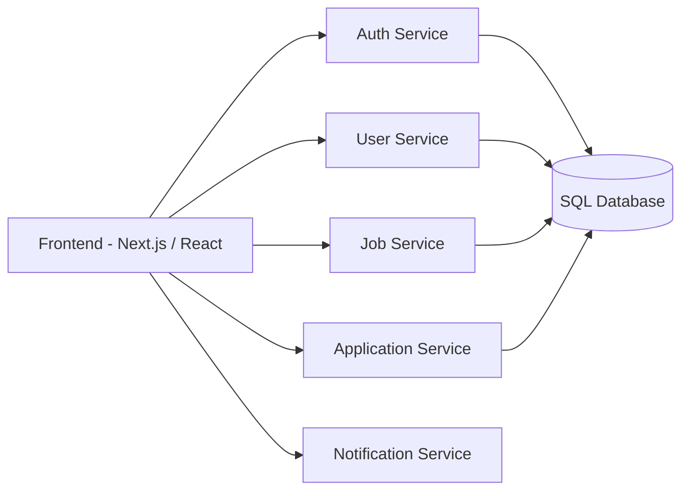
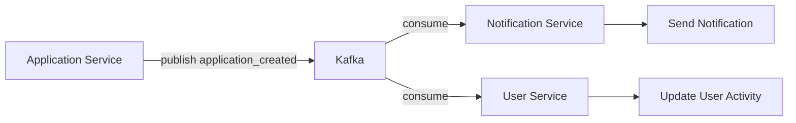
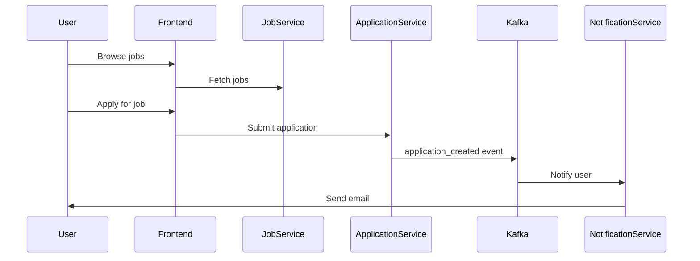

# 💼 Job Portal System

A **scalable microservices-based job portal platform** built for modern hiring workflows.

This project demonstrates a **production-level backend architecture** using:

- Node.js + TypeScript
- Microservices architecture
- Kafka-based event-driven communication
- JWT Authentication + Redis caching
- SQL databases
- Docker containerization

The platform supports **job seekers, recruiters, job applications, notifications, and real-time communication between services**.

---

# 📌 Project Overview

The Job Portal is designed as a **distributed system**, where each feature is handled by an independent microservice.

Instead of a monolithic backend, services communicate via:

- **REST APIs (synchronous)**
- **Kafka events (asynchronous)**

---

# 🧠 System Architecture


---

# 🔁 Communication Models

## 🔹 Synchronous Communication (REST APIs)

Used when immediate response is required.

    Frontend → Auth Service
    Frontend → Job Service
    Frontend → User Service
    Frontend → Application Service

---

## 🔹 Asynchronous Communication (Kafka)

Used for decoupled and scalable workflows.

    Application Service
            │
            ▼
    Publish application_created event
            │
            ▼
    Kafka
            │
            ▼
    Notification Service consumes event

---

# ⚡ Event Driven Architecture


---

# 📦 Microservices

## 1️⃣ Auth Service

Handles authentication and user management.

Features:

- User registration  
- Login  
- JWT authentication  
- Role-based access  
- Auth middleware  

---

## 2️⃣ User Service

Manages user profiles.

Features:

- Profile management  
- Resume upload  
- Skills & experience tracking  

---

## 3️⃣ Job Service

Core service responsible for job operations.

Features:

- Job creation  
- Job updates  
- Job search & filtering  
- Company/job listings  

Events published:

    job_created
    job_updated

---

## 4️⃣ Application Service

Handles job applications.

Features:

- Apply for jobs  
- Track application status  
- Recruiter actions (accept/reject)  

Events published:

    application_created
    application_updated

---

## 5️⃣ Notification Service

Handles system notifications.

Features:

- Email notifications  
- Event-based alerts  
- Kafka consumers  

---

## 6️⃣ Mail Service

Handles email delivery.

Features:

- Consumes Kafka events  
- Sends emails asynchronously  
- Retry mechanism  

---

# 💻 Frontend

The frontend is built using **React + TypeScript + Next.js**.

Structure:

    frontend
     ├ components
     ├ pages
     ├ context
     ├ utils
     └ assets

---

# 🔐 Authentication Flow

    User Login
       ↓
    Generate JWT Token
       ↓
    Store session in Redis
       ↓
    Protected routes verify token

---

# 📊 Application Lifecycle



---

# 🐳 Docker Setup

Each microservice runs inside its own container.

Services include:

    auth
    user
    job
    application
    notification
    mail
    frontend

Each service contains a Dockerfile.

---

# 📦 Tech Stack

## Frontend
- React  
- TypeScript  
- Next.js  

## Backend
- Node.js  
- Express.js  
- TypeScript  

## Database
- PostgreSQL / MySQL  

## Messaging
- Kafka  

## Caching
- Redis  

## Authentication
- JWT  

## Containerization
- Docker  

---

# 🚀 Installation

Clone the repository

    git clone https://github.com/your-username/job-portal.git

Navigate into project

    cd job-portal

Install dependencies

    npm install

Run development servers

    npm run dev

---

# 🎯 Key Features

- Microservices architecture  
- Kafka-based event-driven system  
- Application tracking system  
- Role-based system (User / Recruiter / Admin)  
- Secure authentication with JWT & Redis  
- Email notification system  
- Dockerized services  

---

# 👨‍💻 Author

**Nikhil Y**

GitHub:
https://github.com/your-username
```
